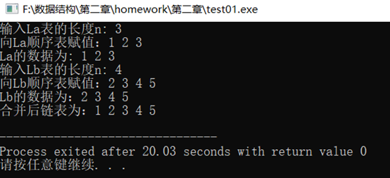
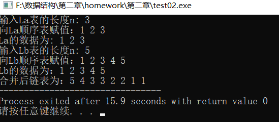
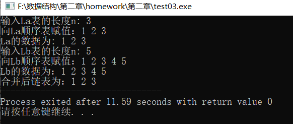
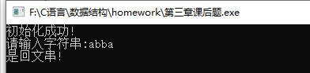
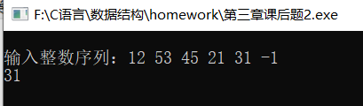
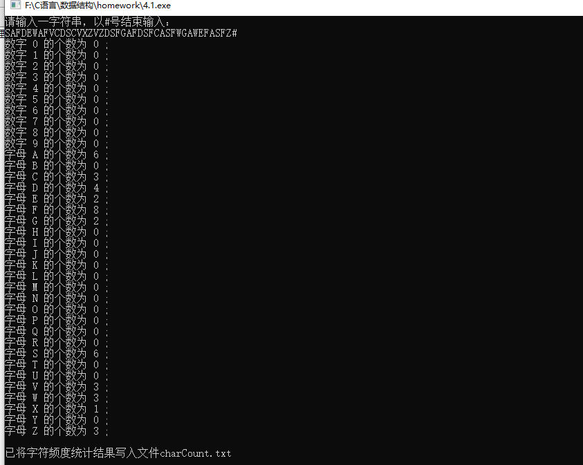
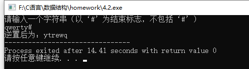
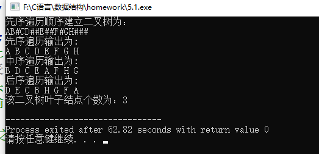
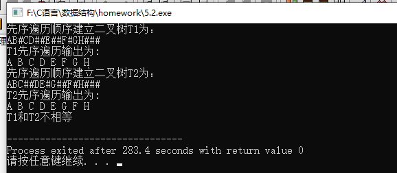
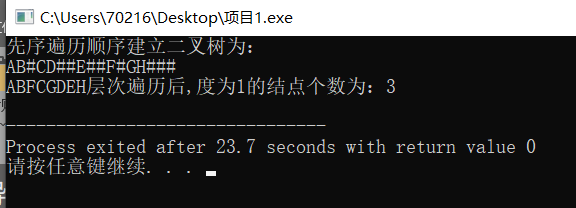

### P53习题

**(1)将两个递增的有序链表合并为一个递增的有序链表。要求结果链表仍使用原来两个链表**

  **的存储空间，不另外占用其他的存储空间。表中不允许有重复的数据。**

```c++
#include <stdio.h>
#include <stdlib.h>
#include <iostream>
#define MAXSIZE 100
#define OK 1
using namespace std;

typedef int ElemType;
typedef struct LNode{
	ElemType  data;
	struct LNode *next;//下一个节点地址
} LNode, *LinkList;

LinkList pa, pb, pc, q, r, t;
LinkList La, Lb, Lc; 

int IintList (LinkList &L){
	L = new LNode;
	L->next=NULL;
	return OK;
}

void MergeList(LinkList &La,LinkList &Lb,LinkList &Lc){ // 合并链表La和Lb，合并后的新表使用头指针Lc指向 
	pa=La->next;
	pb=Lb->next;//pa和pb分别是链表La和Lb的工作指针，初始化为相应链表的第一个结点
	
	Lc = pc =La; //用La的头结点作为Lc的头结点
    while(pa && pb){
	    if(pa->data<pb->data){
	        pc->next=pa;
	        pc=pa;
	        pa=pa->next;
	    }	//取较小者La中的元素，将pa链接在pc的后面，pa的指针后移
		else if(pa->data>pb->data){
			pc->next=pb;
	        pc=pb;
	        pb=pb->next;
		}   //取较小者Lb中的元素，将pb链接在pc的后面，pb的指针后移
		else{
	        pc->next = pa;
			pc = pa;
			pa = pa->next;
			q = pb->next;
			delete pb;
			pb = q;   
		}	//相等时取La中的元素，删除Lb中的元素 
	}
   pc->next = pa ? pa : pb;  
   delete Lb;          
}

int main(){
	int i, n;
	IintList(La); 
	IintList(Lb);
	
    printf("输入La表的长度n: ");
	scanf("%d", &n);
	// 尾插法
	printf("向La顺序表赋值：");
	r = La;
	for(i = 0;i < n; i++){
		pa = new LNode; 
		cin>>pa->data;

		pa->next = NULL;
        r->next = pa;
        r = pa;
	}
	printf("La的数据为: ");
	//链表遍历 
	pa = La->next;
	while (pa){
		printf("%d ", pa->data);
		pa = pa->next;
	}
	printf("\n输入Lb表的长度n: ");
	scanf("%d", &n);
	// 尾插法
	printf("向Lb顺序表赋值：");
	r = Lb;
	for(i = 0;i <n; i++){
		pb = new LNode;  
		cin>>pb->data;
		
		pb->next = NULL;
		r->next = pb;
		r = pb;	
	}
	printf("Lb的数据为：");
	//链表遍历
	pb = Lb->next;
	while (pb){
		printf("%d ", pb->data);
		pb = pb->next;
	}
	printf("\n");
	MergeList(La, Lb, Lc);
	//链表遍历
	t = La->next;
	printf("合并后链表为：");
	while(t){
		printf("%d ",t->data);
		t = t->next;
	}
	printf("\n");
}
```

**运行截图：**



**(2)将两个非递减的有序链表合并为一个非递增的有序链表。要求结果链表仍使用原来两个链表的存储空间,不另外占用其他的存储空间。表中允许有重复的数据。**

```c++
#include <stdio.h>
#include <stdlib.h>
#include <iostream>
#define MAXSIZE 100
#define OK 1
using namespace std;

typedef int ElemType;
typedef struct LNode{
	ElemType data;
	struct LNode * next;	//下一个节点地址
}LNode, *LinkList;

LinkList pa, pb, pc, q, r, t;
LinkList La, Lb, Lc;

int IintList (LinkList &L){
	L = new LNode;
	L->next=NULL;
	return OK;
}

void MergeList(LinkList &La,LinkList &Lb,LinkList &Lc){ //合并链表La和Lb，合并后的新表使用头指针Lc指向
    pa=La->next;
    pb=Lb->next; //pa和pb分别是链表La和Lb的工作指针，初始化为相应链表的第一个结点
    
    Lc = pc =La; //用La的头结点作为Lc的头结点
    Lc->next = NULL;
    while(pa || pb){//只要存在一个非空表，用q指向待摘取的元素 
    	if(!pa){
    		q = pb;
    		pb = pb->next;
		} //La表为空，用q指向pb，pb指针后移
		else if(!pb){
			q = pb;
			pa = pa->next; 
		} //Lb表为空，用q指向pa，pa指针后移
		else if(pa->data<=pb->data){
			q = pa;
			pa = pa->next;
		} //取较小者（包括等于）La中的元素，用q指向pa，pa指针后移 
		else{
	        q = pb;
			pb = pb->next;
		} //取较小者Lb中的元素，用q指向pb，pb指针后移 
		q->next = Lc->next;
		Lc->next = q; //将q指向的结点插在Lc表的表头结点之后 
	}
	delete Lb; //释放Lb的头结点 
} 

int main(){
    int i, n;
	IintList(La); 
	IintList(Lb);
	
    printf("输入La表的长度n: ");
	scanf("%d", &n);
	printf("向La顺序表赋值：");
	//尾插法 
	r = La; 
	for(i = 0;i < n; i++){
		pa = new LNode; 
		cin>>pa->data;
		
		pa->next = NULL;
		r->next = pa;
		r = pa;
	}
	printf("La的数据为: ");
	//链表La遍历 
	pa = La->next;
	while (pa){
		printf("%d ", pa->data);
		pa = pa->next;
	}
	printf("\n输入Lb表的长度n: ");
	scanf("%d", &n);
	printf("向Lb顺序表赋值：");
	//尾插法
	r = Lb; 
	for(i = 0;i <n; i++){
		pb = new LNode;  
		cin>>pb->data;
		
		pb->next = NULL;
		r->next = pb;
		r = pb;
	}
	printf("Lb的数据为：");
	//链表Lb的遍历 
	pb = Lb->next;
	while (pb){
		printf("%d ", pb->data);
		pb = pb->next;
	}
	printf("\n");
	MergeList(La, Lb, Lc);
	printf("合并后链表为：");
	//链表遍历
	t = La->next;
	while(t){
		printf("%d ",t->data);
		t = t->next;
	}	
}
```

**运行截图：**



**(3)已知两个链表A和B分别表示两个集合，其元素递增排列。 请设计一个算法，用于求出A与B的交集，并存放在A链表中。**

```c++
#include <stdio.h>
#include <stdlib.h>
#include <iostream>
#define MAXSIZE 100
#define OK 1
using namespace std;

typedef int ElemType;
typedef struct LNode{
	ElemType  data;
	struct LNode *next; //下一个节点地址
} LNode, *LinkList;

LinkList pa, pb, pc, u, r, t;
LinkList La, Lb, Lc; 

int IintList (LinkList &L){
	L = new LNode;
	L->next=NULL;
	return OK;
}

void Mix(LinkList &La,LinkList &Lb,LinkList &Lc){
    pa = La->next;
    pb = Lb->next;	//pa和pb分别是链表La和Lb的工作指针，初始化为相应链表的第一个结点
    
    Lc = pc =La; //用La的头结点作为Lc的头结点
    while(pa && pb){
    	if(pa->data == pb->data){	//交集并入结果表中 
    		pc->next = pa;
			pc = pa;
			pa = pa->next;
			u = pb;
			pb = pb->next;
			delete u; 
		}
		else if(pa->data<pb->data){
			u = pa;
			pa = pa->next;
			delete u;
		}
		else{
			u = pb;
			pb = pb->next;
			delete u;
		}
	}
	while(pa){
		u = pa;
		pa = pa->next;
		delete u;
	} //释放结点空间 
	while(pb){
		u = pb;
		pb = pb->next;
		delete u;
	} //释放结点空间 
	pc->next = NULL; //置链表尾标记 
	delete Lb; //释放Lb的头结点 
}

int main(){
	int i, n;
	IintList(La); 
	IintList(Lb);
	printf("输入La表的长度n: ");
	scanf("%d", &n);
	printf("向La顺序表赋值：");
	//尾插法
    r = La;
	for(i = 0;i < n; i++){
		pa = new LNode; 
		cin>>pa->data;
		
		pa->next = NULL;
		r->next = pa;
		r = pa;
	}
	printf("La的数据为: ");
	//链表La的遍历 
	pa = La->next;
	while (pa){
		printf("%d ",pa->data);
		pa = pa->next;
	}
	printf("\n输入Lb表的长度n: ");
	scanf("%d", &n);
	printf("向Lb顺序表赋值：");
	//尾插法 
	r = Lb;
	for(i = 0;i <n; i++){
		pb = new LNode;  
		cin>>pb->data;
		
		pb->next = NULL;
		r->next = pb;
		r = pb;
	}
	printf("Lb的数据为：");
	//链表Lb的遍历 
	pb = Lb->next;
	while (pb){
		printf("%d ", pb->data);
		pb = pb->next;
	}
	Mix(La,Lb,Lc);
	printf("\n合并后链表为：");
	
	t = La->next;	
	while(t){
		printf("%d ",t->data);
		t = t->next;
	}
} 
```

**运行截图：**



### P85习题

**(2)回文是指正读反读均相同的字符序列，如：“abba ”和 “abdba ” 均是回文，但“good ” 不是回文。
  试写一个算法判定给定的字符序列是否为回文。（提示：将一半字符入栈） **

```c++
#include<stdio.h>
#include<String.h>
#define MAX 100

//定义一个栈 
typedef struct{
	char *base;
	char *top;
	int stacksize;
}SqStack;
 
//初始化栈 
int InitStack(SqStack &S){
	S.base=new char[MAX];
	if(!S.base){
		return 0;
	}
	S.top=S.base;
	S.stacksize=MAX;
	return 1;
} 
 
//判断栈是否为空
int IsEmpty(SqStack &S){
	if(S.top==S.base){
		return 1;//栈空 
	}else{
		return 0;//栈非空 
	}
}
 
//判断栈是否满
int IsFull(SqStack &S){
	if(S.top-S.base==S.stacksize){
		return 1;//栈满 
	}else{
		return 0;//栈空 
	}
} 
 
//进栈
int Push(SqStack &S,char e){
	if(IsFull(S)){
		return 0;//栈满，无法入栈 
	}
	*S.top++=e;
	return 1;
} 

//出栈
int Pop(SqStack &S,char &e){
	if(IsEmpty(S)){
		return 0;//栈空，无法出栈 
	}
	e=*--S.top;
	return 1;
}
 
 
int IsHuiWen2(SqStack &S,char str[]){
	int len=strlen(str);
	int m=len/2;
	int i;
	char temp;
	for(i=0;i<m;i++){
		Push(S,str[i]);
	}

	if(len%2==0){
		while(!IsEmpty(S)){
			char e;
			Pop(S,e);
			temp=e;
			if(temp!=str[i]){
				return 0;
			}else{
				i++;
			}
		}
	}else if(len%2!=0){
		i=i+1;
		while(!IsEmpty(S)){
			char e;
			Pop(S,e);
			temp=e;
			if(temp!=str[i]){
				return 0;
			}else{
				i++;
			}
		}
	}
	return 1;
}
 
 
int main(){
	SqStack S;
	
	if(InitStack(S)){
		printf("初始化成功!\n");
	}else{
		printf("初始化失败!\n");
	}
	
	printf("请输入字符串:");
	char str[20];
	scanf("%s",str);
	if(IsHuiWen2(S,str)){
		printf("是回文串!\n");
	}else{
		printf("不是回文串!\n");
	}
}
```

**运行截图**


**(3)设从键盘输入一整数的序列：a1,a2,a3,...an,试编写算法实现：
   用栈结构存储输入的整数，当ai≠-1时，将ai进栈；当ai=-1时，输入栈顶整数并出栈。
   算法应对异常情况（入栈满等）给出相应的信息。 **

```c++
#include <iostream>
#include <stdlib.h>

typedef int Status;
const int TRUE = 1;
const int FALSE = 0;
const int STACK_MAXSIZE = 5;
 
using namespace std;

typedef struct{
    int *base;
    int *top;
    int stacksize;
} SqStack;

void Init_Stack(SqStack &S){
    S.base=new int [STACK_MAXSIZE];
    if(!S.base) return;
    S.top=S.base;
    S.stacksize=STACK_MAXSIZE;
}

Status Push_Stack(SqStack &s, int &e)
{
	if(s.top - s.base == s.stacksize)
	{
		cout<<"\nerror:栈满";
		return FALSE;
	}
	else
	{
		*s.top = e;
		s.top ++;		
	}
	return TRUE;
}
 
Status Pop_Stack(SqStack &s, int &e)
{
	if(s.top == s.base)
	{
		cout<<"\n栈空，无法执行出栈操作";
		return FALSE;
	}
	else
	{
		s.top--;
		e = *s.top;
	}
	return TRUE;
}
 
int main()
{
	//Page85.2.(3)
	int input_num, pop_num;
	SqStack s;
 
	cout<<"\n输入整数序列：";
	Init_Stack(s);
	do
	{
		cin>>input_num;
		if(input_num == -1)
		{
			if(Pop_Stack(s, pop_num))
			{
				cout<<pop_num;
			}
		}
		else
		{
			Push_Stack(s, input_num);
		}
	}while(s.top - s.base <= s.stacksize);

	system("PAUSE");
}
```

**运行截图**



### P109习题

**(1)写一个算法统计在输入字符串中各个不同字符出现的频度并将结果存入文件（字符串中的合法字符串为A~Z这26个字母和0 ~ 9这10个数字)。**

```c++
#include <stdio.h>
#include <stdlib.h>
#include <string.h>

void charCount() {
	int i,j,digit_num[10],cap_num[26];
	char ch;
	FILE *fp = NULL;
	for (i=0; i<10; i++)
		digit_num[i]=0;
	for (j=0; j<26; j++)
		cap_num[j]=0;
	while((ch = getchar())!= '#') {
		switch(ch){
			case 'A'...'Z':
				j=ch-65;
				cap_num[j]++;
				continue;
			case '0'...'9':
				i=ch-48;
				digit_num[i]++;
				continue;
			default:
				printf("请输入合法字符（A~Z或0~9）！");
				exit(0);
		}
	}
	fp = fopen("charCount.txt", "w+");
	for (i=0; i<10; i++) {
		printf("数字 %d 的个数为 %d ;\n",i,digit_num[i]);
		if (fprintf(fp,"数字 %d 的个数为 %d ;\n",i,digit_num[i]) ==NULL) printf("ERROR:结果写入文件charCount.txt失败\n");
	}
	for (j=0; j<26; j++) {
		printf("字母 %c 的个数为 %d ;\n",j+65,cap_num[j]);
		if (fprintf(fp,"字母 %c 的个数为 %d ;\n",j+65,cap_num[j]) == NULL) printf("ERROR:结果写入文件charCount.txt失败\n");
	}
	printf("\n已将字符频度统计结果写入文件charCount.txt\n");
	fclose(fp);
}

int main () {
	printf("请输入一字符串，以#号结束输入：\n");
	charCount();
	return 0;
}
```

**运行截图**




**（2）写一个递归算法来实现字符串逆序存储，要求不另设串存储空间**

```c++
#include <iostream>
using namespace std;
 
void invert(char A[])
{
    char ch;
    static int i=0;//利用静态变量存储数组下标
    cin>>ch;
    if(ch!='#')
    {
        invert(A);
        A[i++]=ch;//先存的放到后边
    }
    A[i]='\0';
}
 
int main()
{
    char A[100];
    cout<<"请输入一个字符串（以‘#’为结束标志，不包括‘#’）"<<endl;
    invert(A);
    cout<<"逆置后为："<<A;//char型数组可以利用数组名直接输出，int型则会输出其首地址
    return 0;
}
```

**运行截图**



### P147习题

**（1）统计二叉树的叶结点个数。**

```c++
#include <iostream>

typedef struct BiTNode{
    char data;
    struct BiTNode *lchild,*rchild;
}BiTNode,*BiTree;
void CreatBiTree(BiTree &T);
void PreOrderTraverse(BiTree T);
void InOrderTraverse(BiTree T);
void PostOrderTraverse(BiTree T);
int LeafCount(BiTree T);
using namespace std;
int main(){
    BiTree T;
    cout<<"先序遍历顺序建立二叉树为："<<endl;
    CreatBiTree(T);
    cout<<"先序遍历输出为:"<<endl;
    PreOrderTraverse(T);
    cout<<endl;
    cout<<"中序遍历输出为:"<<endl;
    InOrderTraverse(T);
    cout<<endl;
    cout<<"后序遍历输出为:"<<endl;
    PostOrderTraverse(T);
    cout<<endl;
    cout<<"该二叉树叶子结点个数为："<<LeafCount(T)<<endl;
    return 0;
}
//先序建立二叉树
void CreatBiTree(BiTree &T){
    char ch;
    cin>>ch;
    if(ch=='#'){
        T=NULL;
    }else if(ch!='#'){
        T=new BiTNode;
        T->data=ch;
        CreatBiTree(T->lchild);
        CreatBiTree(T->rchild);
    }
}
//前序遍历:若结点不为空就输出，遍历左子树，然后遍历右子树；
//若为空就不输出
void PreOrderTraverse(BiTree T){
    if(T){
        cout<<T->data<<" ";
        PreOrderTraverse(T->lchild);
        PreOrderTraverse(T->rchild);
    }
}
//中序遍历:若结点不为空就遍历左子树，输出根结点数据，再遍历右子树；
//为空就不输出
void InOrderTraverse(BiTree T){
    if(T){
        InOrderTraverse(T->lchild);
        cout<<T->data<<" ";
        InOrderTraverse(T->rchild);
    }
}
//后序遍历:若结点不为空就遍历左子树，然后遍历右子树，输出根结点数据；
//若为空就不输出
void PostOrderTraverse(BiTree T){
    if(T){
        PostOrderTraverse(T->lchild);
        PostOrderTraverse(T->rchild);
        cout<<T->data<<" ";
    }
}
//叶子结点个数
int LeafCount(BiTree T){
    if(T==NULL){
        return 0;
    }else if(T->lchild==NULL && T->rchild==NULL){
        return 1;
    }else{
        return LeafCount(T->lchild)+LeafCount(T->rchild);
    }
}
```

**运行截图**



**(2)判断两棵树是否相等**

```c++
#include <iostream>
typedef struct BiTNode{
    char data;
    struct BiTNode *lchild,*rchild;
}BiTNode,*BiTree;
void InitBiTree(BiTree &T);
void CreatBiTree(BiTree &T);
void PreOrderTraverse(BiTree T);
bool IsEqual(BiTree T1,BiTree T2);
using namespace std;
int main(){
    BiTree T1,T2;
    cout<<"先序遍历顺序建立二叉树T1为："<<endl;
    CreatBiTree(T1);
    cout<<"T1先序遍历输出为:"<<endl;
    PreOrderTraverse(T1);
    cout<<endl;

    cout<<"先序遍历顺序建立二叉树T2为："<<endl;
    CreatBiTree(T2);
    cout<<"T2先序遍历输出为:"<<endl;
    PreOrderTraverse(T2);
    cout<<endl;
    if(IsEqual(T1,T2)){
        cout<<"T1和T2相等"<<endl;
    }else if(!IsEqual(T1,T2)){
        cout<<"T1和T2不相等"<<endl;
    }
}
void InitBiTree(BiTree &T){
}
//先序建立二叉树
void CreatBiTree(BiTree &T){
    char ch;
    cin>>ch;
    if(ch=='#'){
        T=NULL;
    }else if(ch!='#' && ch!='!'){
        T=new BiTNode;
        T->data=ch;
        CreatBiTree(T->lchild);
        CreatBiTree(T->rchild);
    }
}
//先序遍历:若结点不为空就输出，遍历左子树，然后遍历右子树；
//         若为空就不输出
void PreOrderTraverse(BiTree T){
    if(T){
        cout<<T->data<<" ";
        PreOrderTraverse(T->lchild);
        PreOrderTraverse(T->rchild);
    }
}
//两棵树是否相等
bool IsEqual(BiTree T1,BiTree T2){
    if((T1==NULL) && (T1==NULL)){//根结点都为空相等
        return true;
    }else if((T1==NULL)!=(T1==NULL)){//根结点一个为空，
                                    //一个不为空不相等
        return false;
    }else if(T1->data!=T2->data){//根结点数据不等就不相等
        return false;
    }
    //结点不空有数据
    return (IsEqual(T1->lchild,T2->lchild)
            && IsEqual(T1->rchild,T2->rchild));
}
```

**运行截图**



**(6)用按层次顺序遍历**

```C++
#include <iostream>
#define m 100
typedef struct BiTNode{
    char data;
    struct BiTNode *lchild,*rchild;
}BiTNode,*BiTree;
typedef struct{
    BiTree base;
    int front;
    int rear;
}SqQueue;
SqQueue Q;
void InitBiTree(BiTree &T);
void CreatBiTree(BiTree &T);
void PreOrderTraverse(BiTree T);
void InitQueue(SqQueue &s);
void EnQueue(SqQueue &s,BiTree T);
BiTree DeQueue(SqQueue &s);
bool IsEmpty(SqQueue s);
int OneCount(BiTree T);
using namespace std;
int main(){
    BiTree T;
    cout<<"先序遍历顺序建立二叉树为："<<endl;
    CreatBiTree(T);
    cout<<"先序遍历输出为:"<<endl;
    PreOrderTraverse(T);
	cout<< "\n层次遍历输出为:" <<endl;
    cout<<"该二叉树度为1的结点个数为："<<OneCount(T)<<endl;
}
void InitBiTree(BiTree &T){
}
//先序建立二叉树
void CreatBiTree(BiTree &T){
    char ch;
    cin>>ch;
    if(ch=='#'){
        T=NULL;
    }else if(ch!='#' && ch!='!'){
        T=new BiTNode;
        T->data=ch;
        CreatBiTree(T->lchild);
        CreatBiTree(T->rchild);
    }
}
void PreOrderTraverse(BiTree T){
    if(T){
        cout<<T->data<<" ";
        PreOrderTraverse(T->lchild);
        PreOrderTraverse(T->rchild);
    }
}
//层次顺序遍历:先进先出符合队列，先让第一层结点入队，然后依次入队；
//依次出队就为层次顺序遍历
//度为1的结点个数
int sum=0;
int OneCount(BiTree bt){
    if(bt){
        InitQueue(Q);
        EnQueue(Q, bt);
        while(!IsEmpty(Q)){
            BiTree p;
            p=DeQueue(Q);
            cout<<p->data;
            if((p->lchild && !p->rchild) ||
               (!p->lchild && p->rchild)){
                sum++;
            }
            if(p->lchild){
                EnQueue(Q,p->lchild);
            }
            if(p->rchild){
                EnQueue(Q,p->rchild);
            }
        }
    }
   return sum;
}

void EnQueue(SqQueue &s,BiTree e){
    if(s.front==(s.rear+1)%m){
        cout<<"队列满了无法入队"<<endl;
    }else{
        s.base[s.rear]=*e;
        s.rear=(s.rear+1)%m;
    }
}
BiTree DeQueue(SqQueue &s){
    BiTree e;
    if(s.front==s.rear){
        cout<<"队列空了无法出队"<<endl;
        return NULL;
    }else{
        *e=s.base[s.front];
        s.front=(s.front+1)%m;
        return e;
    }
}
//初始化循环队列
void InitQueue(SqQueue &s){
    s.base=new BiTNode[m];
    s.front=s.rear=0;
}
bool IsEmpty(SqQueue s){
    if(s.front==s.rear){
        return true;
    }else{
        return false;
    }
}
```

**运行截图**


