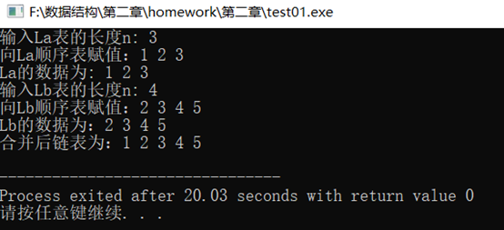
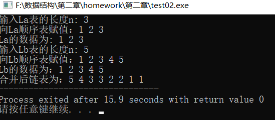
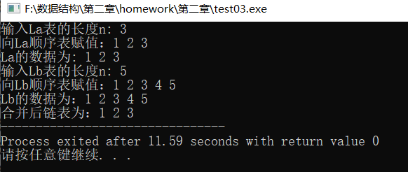

**(1)将两个递增的有序链表合并为一个递增的有序链表。要求结果链表仍使用原来两个链表**

  **的存储空间，不另外占用其他的存储空间。表中不允许有重复的数据。**

```c++
#include <stdio.h>
#include <stdlib.h>
#include <iostream>
#define MAXSIZE 100
#define OK 1
using namespace std;

typedef int ElemType;
typedef struct LNode{
	ElemType  data;
	struct LNode *next;//下一个节点地址
} LNode, *LinkList;

LinkList pa, pb, pc, q, r, t;
LinkList La, Lb, Lc; 

int IintList (LinkList &L){
	L = new LNode;
	L->next=NULL;
	return OK;
}

void MergeList(LinkList &La,LinkList &Lb,LinkList &Lc){ // 合并链表La和Lb，合并后的新表使用头指针Lc指向 
	pa=La->next;
	pb=Lb->next;//pa和pb分别是链表La和Lb的工作指针，初始化为相应链表的第一个结点
	
	Lc = pc =La; //用La的头结点作为Lc的头结点
    while(pa && pb){
	    if(pa->data<pb->data){
	        pc->next=pa;
	        pc=pa;
	        pa=pa->next;
	    }	//取较小者La中的元素，将pa链接在pc的后面，pa的指针后移
		else if(pa->data>pb->data){
			pc->next=pb;
	        pc=pb;
	        pb=pb->next;
		}   //取较小者Lb中的元素，将pb链接在pc的后面，pb的指针后移
		else{
	        pc->next = pa;
			pc = pa;
			pa = pa->next;
			q = pb->next;
			delete pb;
			pb = q;   
		}	//相等时取La中的元素，删除Lb中的元素 
	}
   pc->next = pa ? pa : pb;  
   delete Lb;          
}

int main(){
	int i, n;
	IintList(La); 
	IintList(Lb);
	
    printf("输入La表的长度n: ");
	scanf("%d", &n);
	// 尾插法
	printf("向La顺序表赋值：");
	r = La;
	for(i = 0;i < n; i++){
		pa = new LNode; 
		cin>>pa->data;

		pa->next = NULL;
        r->next = pa;
        r = pa;
	}
	printf("La的数据为: ");
	//链表遍历 
	pa = La->next;
	while (pa){
		printf("%d ", pa->data);
		pa = pa->next;
	}
	printf("\n输入Lb表的长度n: ");
	scanf("%d", &n);
	// 尾插法
	printf("向Lb顺序表赋值：");
	r = Lb;
	for(i = 0;i <n; i++){
		pb = new LNode;  
		cin>>pb->data;
		
		pb->next = NULL;
		r->next = pb;
		r = pb;	
	}
	printf("Lb的数据为：");
	//链表遍历
	pb = Lb->next;
	while (pb){
		printf("%d ", pb->data);
		pb = pb->next;
	}
	printf("\n");
	MergeList(La, Lb, Lc);
	//链表遍历
	t = La->next;
	printf("合并后链表为：");
	while(t){
		printf("%d ",t->data);
		t = t->next;
	}
	printf("\n");
}
```

**运行截图：**



**(2)将两个非递减的有序链表合并为一个非递增的有序链表。要求结果链表仍使用原来两个链表的存储空间,不另外占用其他的存储空间。表中允许有重复的数据。**

```c++
#include <stdio.h>
#include <stdlib.h>
#include <iostream>
#define MAXSIZE 100
#define OK 1
using namespace std;

typedef int ElemType;
typedef struct LNode{
	ElemType data;
	struct LNode * next;	//下一个节点地址
}LNode, *LinkList;

LinkList pa, pb, pc, q, r, t;
LinkList La, Lb, Lc;

int IintList (LinkList &L){
	L = new LNode;
	L->next=NULL;
	return OK;
}

void MergeList(LinkList &La,LinkList &Lb,LinkList &Lc){ //合并链表La和Lb，合并后的新表使用头指针Lc指向
    pa=La->next;
    pb=Lb->next; //pa和pb分别是链表La和Lb的工作指针，初始化为相应链表的第一个结点
    
    Lc = pc =La; //用La的头结点作为Lc的头结点
    Lc->next = NULL;
    while(pa || pb){//只要存在一个非空表，用q指向待摘取的元素 
    	if(!pa){
    		q = pb;
    		pb = pb->next;
		} //La表为空，用q指向pb，pb指针后移
		else if(!pb){
			q = pb;
			pa = pa->next; 
		} //Lb表为空，用q指向pa，pa指针后移
		else if(pa->data<=pb->data){
			q = pa;
			pa = pa->next;
		} //取较小者（包括等于）La中的元素，用q指向pa，pa指针后移 
		else{
	        q = pb;
			pb = pb->next;
		} //取较小者Lb中的元素，用q指向pb，pb指针后移 
		q->next = Lc->next;
		Lc->next = q; //将q指向的结点插在Lc表的表头结点之后 
	}
	delete Lb; //释放Lb的头结点 
} 

int main(){
    int i, n;
	IintList(La); 
	IintList(Lb);
	
    printf("输入La表的长度n: ");
	scanf("%d", &n);
	printf("向La顺序表赋值：");
	//尾插法 
	r = La; 
	for(i = 0;i < n; i++){
		pa = new LNode; 
		cin>>pa->data;
		
		pa->next = NULL;
		r->next = pa;
		r = pa;
	}
	printf("La的数据为: ");
	//链表La遍历 
	pa = La->next;
	while (pa){
		printf("%d ", pa->data);
		pa = pa->next;
	}
	printf("\n输入Lb表的长度n: ");
	scanf("%d", &n);
	printf("向Lb顺序表赋值：");
	//尾插法
	r = Lb; 
	for(i = 0;i <n; i++){
		pb = new LNode;  
		cin>>pb->data;
		
		pb->next = NULL;
		r->next = pb;
		r = pb;
	}
	printf("Lb的数据为：");
	//链表Lb的遍历 
	pb = Lb->next;
	while (pb){
		printf("%d ", pb->data);
		pb = pb->next;
	}
	printf("\n");
	MergeList(La, Lb, Lc);
	printf("合并后链表为：");
	//链表遍历
	t = La->next;
	while(t){
		printf("%d ",t->data);
		t = t->next;
	}	
}
```

**运行截图：**



**(3)已知两个链表A和B分别表示两个集合，其元素递增排列。 请设计一个算法，用于求出A与B的交集，并存放在A链表中。**

```c++
#include <stdio.h>
#include <stdlib.h>
#include <iostream>
#define MAXSIZE 100
#define OK 1
using namespace std;

typedef int ElemType;
typedef struct LNode{
	ElemType  data;
	struct LNode *next; //下一个节点地址
} LNode, *LinkList;

LinkList pa, pb, pc, u, r, t;
LinkList La, Lb, Lc; 

int IintList (LinkList &L){
	L = new LNode;
	L->next=NULL;
	return OK;
}

void Mix(LinkList &La,LinkList &Lb,LinkList &Lc){
    pa = La->next;
    pb = Lb->next;	//pa和pb分别是链表La和Lb的工作指针，初始化为相应链表的第一个结点
    
    Lc = pc =La; //用La的头结点作为Lc的头结点
    while(pa && pb){
    	if(pa->data == pb->data){	//交集并入结果表中 
    		pc->next = pa;
			pc = pa;
			pa = pa->next;
			u = pb;
			pb = pb->next;
			delete u; 
		}
		else if(pa->data<pb->data){
			u = pa;
			pa = pa->next;
			delete u;
		}
		else{
			u = pb;
			pb = pb->next;
			delete u;
		}
	}
	while(pa){
		u = pa;
		pa = pa->next;
		delete u;
	} //释放结点空间 
	while(pb){
		u = pb;
		pb = pb->next;
		delete u;
	} //释放结点空间 
	pc->next = NULL; //置链表尾标记 
	delete Lb; //释放Lb的头结点 
}

int main(){
	int i, n;
	IintList(La); 
	IintList(Lb);
	printf("输入La表的长度n: ");
	scanf("%d", &n);
	printf("向La顺序表赋值：");
	//尾插法
    r = La;
	for(i = 0;i < n; i++){
		pa = new LNode; 
		cin>>pa->data;
		
		pa->next = NULL;
		r->next = pa;
		r = pa;
	}
	printf("La的数据为: ");
	//链表La的遍历 
	pa = La->next;
	while (pa){
		printf("%d ",pa->data);
		pa = pa->next;
	}
	printf("\n输入Lb表的长度n: ");
	scanf("%d", &n);
	printf("向Lb顺序表赋值：");
	//尾插法 
	r = Lb;
	for(i = 0;i <n; i++){
		pb = new LNode;  
		cin>>pb->data;
		
		pb->next = NULL;
		r->next = pb;
		r = pb;
	}
	printf("Lb的数据为：");
	//链表Lb的遍历 
	pb = Lb->next;
	while (pb){
		printf("%d ", pb->data);
		pb = pb->next;
	}
	Mix(La,Lb,Lc);
	printf("\n合并后链表为：");
	
	t = La->next;	
	while(t){
		printf("%d ",t->data);
		t = t->next;
	}
} 
```

**运行截图：**

